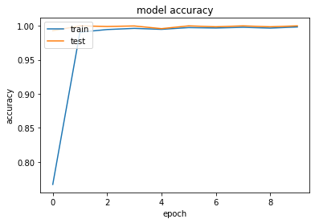
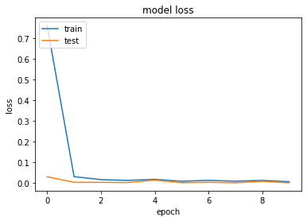

# SIgn_Language
It is a Deep learning model for predicting the sign language. It takes the image of size 28*28 as an input and predict the sign language.

<h3>Dataset</h3>
The original MNIST image dataset of handwritten digits is a popular benchmark for image-based machine learning methods but researchers have renewed efforts to update it and develop drop-in replacements that are more challenging for computer vision and original for real-world applications. As noted in one recent replacement called the Fashion-MNIST dataset, the Zalando researchers quoted the startling claim that "Most pairs of MNIST digits (784 total pixels per sample) can be distinguished pretty well by just one pixel". To stimulate the community to develop more drop-in replacements, the Sign Language MNIST is presented here and follows the same CSV format with labels and pixel values in single rows. The American Sign Language letter database of hand gestures represent a multi-class problem with 24 classes of letters (excluding J and Z which require motion). 
<b>Link:-</b>https://www.kaggle.com/datamunge/sign-language-mnist
 

<h3>Model's Performance</h3>

<h5>Accuracy</h5>

<h5>Loss</h5>

